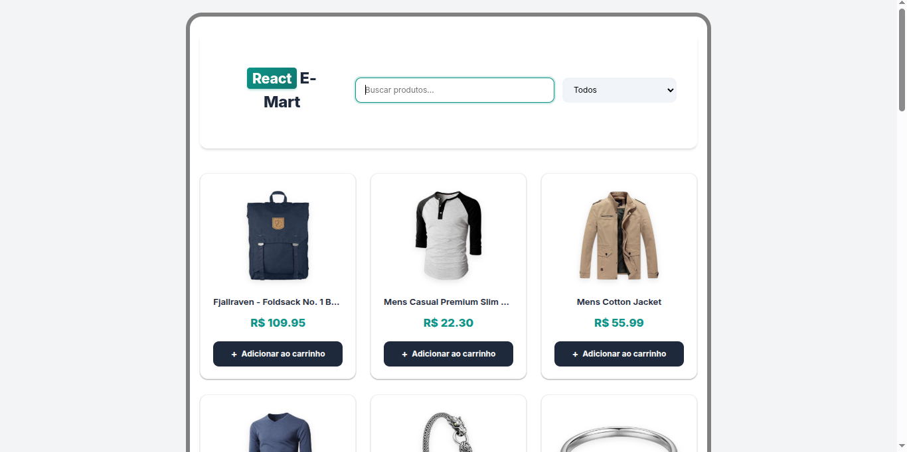

# react-basics-26
react course given by also an UFES Student (ShotOut to my friend FlavioMonteiro)
# React Básico - 2026/1 ⚛️

This repository documents my progress through the **React Basic** course. It contains a collection of practical exercises, component studies, and the final capstone project: **React E-Mart**.


*(Note: You can replace this path with the actual path to your screenshot, e.g., image_46eaa8.png)*

## 📂 Repository Overview

This project was built using **Vite** and is structured to house both isolated learning exercises and the main e-commerce application.

### 🚀 Final Project: React E-Mart
A functional e-commerce interface that consumes data from an external API.
* **Data Source:** [FakeStoreAPI](https://fakestoreapi.com/)
* **Features:**
    * Product listing (fetching data from API).
    * Search functionality ("Buscar produtos...").
    * Category filtering.
    * Responsive Card components for product display.

### 📚 Course Exercises
Smaller components built to master specific React concepts:
* **Contador:** A simple counter to understand `useState`.
* **ContadorCaracter:** A utility to track input length, practicing event handling.

---

## 🛠️ Technologies Used

* **Core:** React.js, JavaScript (ES6+)
* **Build Tool:** Vite
* **Styling:** CSS Modules / Standard CSS
* **Linting:** ESLint

---

## 📂 Project Structure

Below is the file structure representing the components developed during the course:

```text
R26/
├── public/ # NODE_MODELUS ARENT COMMITED ON MY GIT (USE NPM DEV RUN // INSTALL)
├── src/
│   ├── assets/
│   ├── components/
│   │   ├── card/               # Product display card
│   │   ├── contador/           # Lesson: State management basic
│   │   ├── contadorCaracter/   # Lesson: Input handling
│   │   ├── footer/             # App footer
│   │   ├── header/             # Navigation and Search bar
│   │   ├── list/               # Product grid container
│   │   ├── login/              # User authentication UI
│   │   ├── main/               # Main layout wrapper
│   │   └── store/              # Main store logic/page
│   ├── App.jsx
│   ├── main.jsx
│   └── index.css
├── index.html
├── package.json
└── vite.config.js
